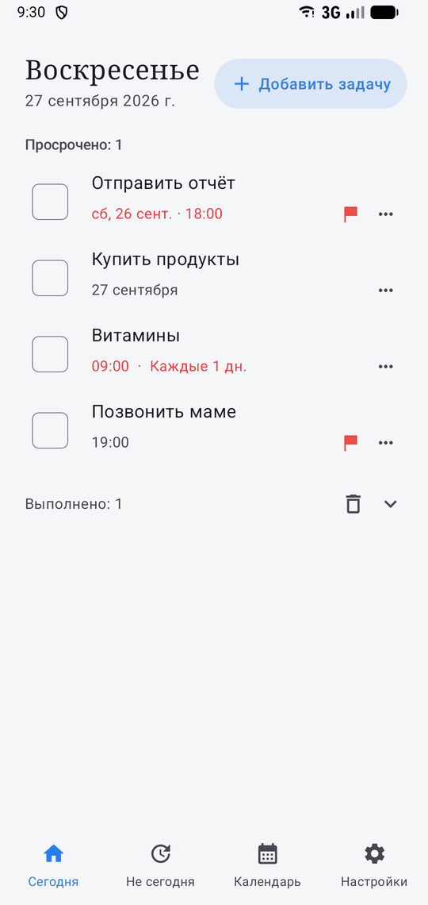
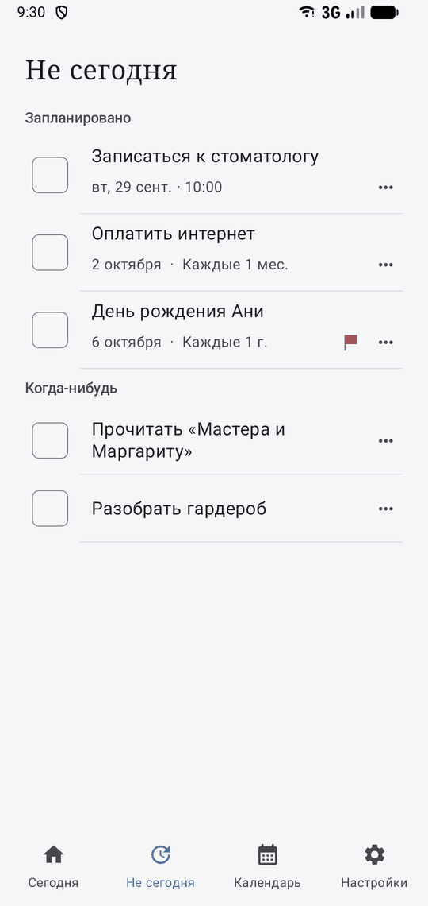
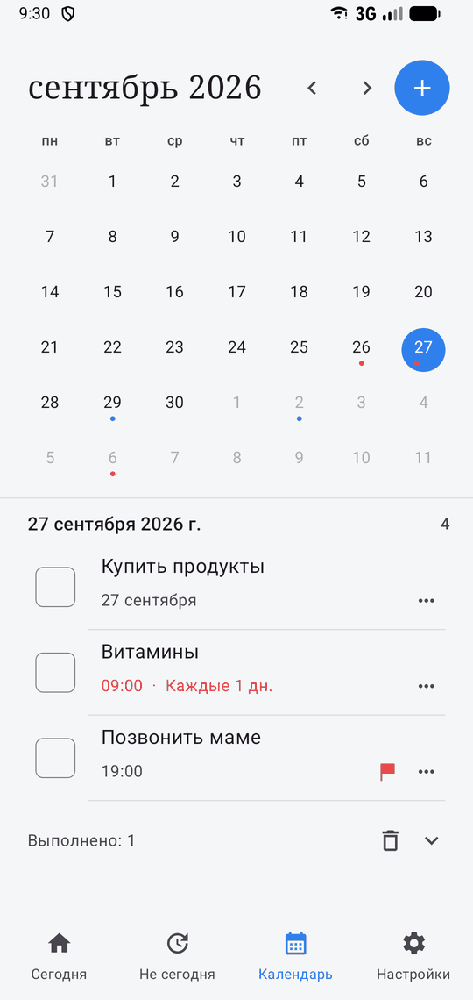
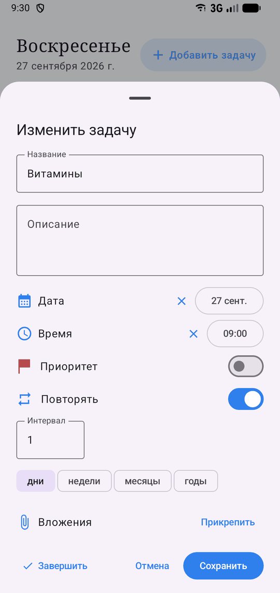
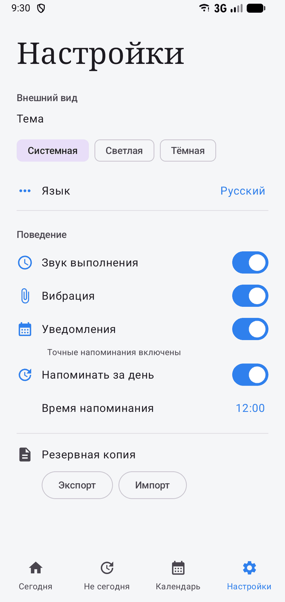
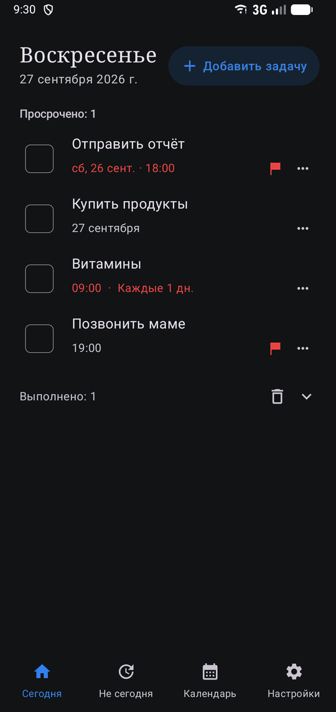

# Не сегодня (NotToday)

Минималистичный легковесный таск-менеджер для Android. Без аккаунтов, без сети, без аналитики — только задачи.

Готовые APK — в разделе [Releases](https://github.com/Dimaff355/NotToday/releases).

<p>
  
  
  
</p>
<p>
  
  
  
</p>

## Возможности

- **Сегодня** — задачи на сегодня и просроченные; смахните задачу влево, чтобы перенести её на завтра
- **Не сегодня** — запланированные задачи и задачи «когда-нибудь» без даты; любую можно взять на сегодня
- **Календарь** — месяц с точками-индикаторами и задачами выбранного дня
- Редактор: название, описание, дата и время, приоритет, повторение, вложения; кнопка «Завершить» прямо в редакторе
- Повторяющиеся задачи: каждые N дней / недель (с выбором дней недели) / месяцев / лет
- Напоминания на точных будильниках: переживают перезагрузку, смену времени и часового пояса; тап по напоминанию открывает задачу, «отложить» — на 10 минут
- Дайджест «Завтра надо» — одно уведомление накануне со списком задач на завтра (время настраивается)
- Отмена любого действия (выполнение, удаление, перенос) из всплывающей подсказки
- Звук и вибрация при выполнении, мягкая анимация фона
- Вложения к задачам (до 20 МБ на файл, до 10 файлов)
- Резервное копирование: экспорт и импорт локального файла бэкапа вместе с вложениями
- Темы: системная / светлая / тёмная; языки: русский, английский, 中文（简体）
- Адаптивная иконка с поддержкой тематических иконок Android 13+

## Приватность

В приложении нет разрешения `INTERNET` — все данные хранятся только на устройстве. Системный автобэкап отключён (`allowBackup=false`), резервные копии создаются вручную и в собственном формате.

Разрешения: уведомления, точные будильники и запуск после перезагрузки — только ради напоминаний.

## Технологии

- Kotlin, Jetpack Compose, Material 3
- Room (KSP), DataStore Preferences
- AlarmManager + уведомления
- Min SDK 26 (Android 8.0), target/compile SDK 37

Ключевой принцип — минимум кода и зависимостей: никакой DI, сети и лишних библиотек.

## Структура

```
app/src/main/java/com/dima/minimaltasks/
├── MainActivity.kt  # Compose-экраны и навигация
├── data/
│   ├── local/       # Room: сущности, DAO, база
│   ├── settings/    # DataStore: настройки
│   ├── backup/      # экспорт/импорт бэкапов
│   └── ...          # репозиторий, вложения
├── domain/          # расчёт повторений
├── notifications/   # напоминания: планировщик, приёмники, уведомления
└── ui/              # ViewModel, форматтеры, модели экранов, тема
artwork/             # исходники иконки и иллюстраций
docs/screenshots/    # скриншоты для README
```

Схемы БД хранятся в `app/schemas/`.
